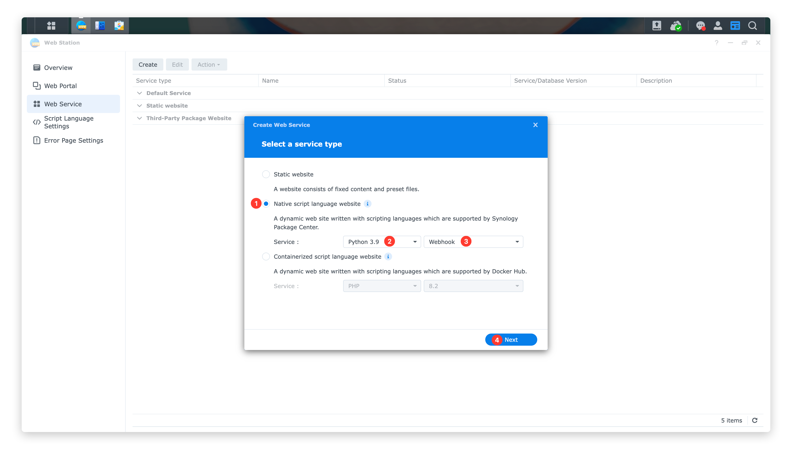

# synology-notification
Synology DSM notification webhook, work with Synology Web Station.

## How to use

### Pre-conditions

#### Install and enable [Web Station](https://www.synology.com/en-us/dsm/packages/WebStation) on your Synology DSM

1. Login your DSM then open `Package Center` application ➡️ Search bar input `web station` ➡️ Get in `Web Station` application.

    

2. If you've installed this package, make it stay in `Running`status, if not, install it then keep it run.

    

#### Install and enable[Python 3.9 ](https://www.synology.com/en-us/dsm/packages/Python3.9)on your Synology DSM

Follow the same path, install `Python 3.9` and make it stay in `Running` status.

### Copy this repository code into your web directory

1. Open `File Station` application, navigate to `web` directory, click `Create` ➡️ `Create folder`

    

2. Enter name then click `OK`

    

3. Navigate into the new folder, click `Action` ➡️ `Upload - Skip`, upload all the files.

    

### Configure Web Station

#### Create a Python profile

1. Open `Web Station` application, Click `Script Language Settings` ➡️ `Python` ➡️ `Create`.

    

2. Input `Profile Name` & `Description`, then click `Next`.

    

3. Set `Process` to `1`, `Max.request count` to `1024`, then click `Next`.

    

4. Click `Browse` button to select the `requirements.txt` file, then click `Next` button.

    

    

    

5. Overview all settings and click `Create` button.

    

#### Create a Web service

1. Open `Web Station` application, Click `Web Service` ➡️ `Create`.

    

2. Select `Native script language website` ➡️ `Python 3.9` ➡️ `Webhook`, then click `Next`.

    

3. Input `Name`/`Description`, then select the correct `Document root` and `WSGI file`, click `Next`.

    

4. Overview all settings and click `Create` button.

    

#### Create a Web portal

1. Open `Web Station` application, Click `Web Portal` ➡️ `Create`.

    

2. Select `Web service portal` type as new portal.

    

3. Set up web service portal detail, if you have private DNS server, you can choose `Name-based` type; For most common scenarios, choose the `Port-based`

    

### Verify service

Use your browser to visit the service page, for common scenarios, try: http://YOUR-DMS-IP:6789

If everything works fine, the website will show this document.

### Configure System notification settings

1. Open `Contorl Panel` application ➡️ `Notification` ➡️ `Webhooks` ➡️ `Add`

    

2. Chose the `Custom` type provider and `All` rule, then click `Next`button.

    

3. Input `Provider name`&`Webhook URL`(For common scenarios, use: http://YOUR-DMS-IP:6789), then click `Next` button.

    

4. Set `HTTP Method` to `POST`, then click the `Add Header` button, fill the API provider's required header keys and values, at the `HTTP Body` section,  add a key-value pair: `"api": "PROVIDER_NAME"`, then click `Apply` button.

    

### Verify webhook

Once you've done above, you can test this webhook by open `Contorl Panel` application ➡️ `Notification` ➡️ `Webhooks` ➡️ ***Select this web hook*** ➡️ `Send Test Message`

## Support providers

- [x] Wechat Work Group Bot (By another of my open source project: [ChowRex/pywgb: Wecom(A.K.A Wechat Work) Group Bot python API.](https://github.com/ChowRex/pywgb))
- [ ] Wechat Work Application
- [ ] DingDing Group Bot
- [ ] Lark(飞书) Group Bot
- [ ] Bark

## Create your own provider (*Technological*)

1. Fork this repository.
2. Refer the code at `synology_notification/api/wecom.py`, create your own provider class in `synology_notification/api/provider.py`
3. The provider class **MUST** be a sub-class of `synology_notification.api._abstract.AbstractServiceProvider` and **MUST** implement methods below (required by `abc.ABC` class).
    - `required_header_keys`:  This is a class method, you should return a list of key string to validate your providers auth info from headers, such as token/oauth/password etc.
    - `send`:  This is the implementation of the specific method of sending a message, you should finish the whole sending work at here.
4. After you've done above, you should add your provider class into `synology_notification._verify.SupportedAPIProviders`, use `name_with_underscore = YourProviderClass` to join the providers enum.
5. Modify the [Configure System notification settings](#Configure System notification settings), change the `api=wecom_group_bot`to `api=name_with_underscore` and pass the auth info via headers settings.
