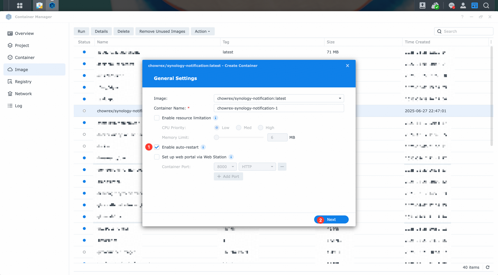

# synology-notification

    

Synology DSM notification webhook, work with Synology Web Station.

## How to use

### Set up service

#### 🐳 With `Docker`

Click here for details

##### Install and enable [Container Manager](https://www.synology.com/en-us/dsm/packages/ContainerManager) on your Synology DSM

1. Login your DSM then open `Package Center` application ➡️ Search bar input `container manager` ➡️ Get in `Container Manager` application.

    

2. If you've installed this package, make it stay in `Running`status, if not, install it then keep it run.

    

##### Pull image

1. Open `Container Manager` application, navigate to `Registry` section, search keyword `chowrex` ➡️ `chowrex/synology-notification` ➡️ `Download`

    

2. Use `latest` tag, click `Download`

    

##### Run container

1. Goto `Image`, select the image just downloaded, click `Run`

    

2. Check `Enable auto-restart` checkbox, then click `Next` button.

    

3. Set the local port to `6789` *(Or any number  between 1024 - 65535, if the port you specify has been taken, change another one)*,  then click `Next` button.

    

4. Overview all settings and click `Done` button.

    

5. After wait for a while, click the container name *(Here is `chowrex-synology-notification-1` )* to enter the detail of container.

    

6. Click the `Log` tab to see all logs, if everything is OK, some info logs will appear.

    

#### 🌐 With `Web Station`

Click here for details

##### Install and enable [Web Station](https://www.synology.com/en-us/dsm/packages/WebStation) on your Synology DSM

1. Login your DSM then open `Package Center` application ➡️ Search bar input `web station` ➡️ Get in `Web Station` application.

    

2. If you've installed this package, make it stay in `Running`status, if not, install it then keep it run.

    

##### Install and enable [Python 3.9 ](https://www.synology.com/en-us/dsm/packages/Python3.9)on your Synology DSM

Follow the same path, install `Python 3.9` and make it stay in `Running` status.

##### Copy this repository code into your web directory

1. Open `File Station` application, navigate to `web` directory, click `Create` ➡️ `Create folder`

    

2. Enter name then click `OK`

    

3. Navigate into the new folder, click `Action` ➡️ `Upload - Skip`, upload all the files.

    

##### Create a Python profile

1. Open `Web Station` application, Click `Script Language Settings` ➡️ `Python` ➡️ `Create`.

    

2. Input `Profile Name` & `Description`, then click `Next`.

    - Profile Name: *Webhook*
    - Description: *Use for system notification*

    

3. Set `Process` to `1`, `Max.request count` to `1024`, then click `Next`.

    

4. Click `Browse` button to select the `requirements.txt` file, then click `Next` button.

    

    

    

5. Overview all settings and click `Create` button.

    

##### Create a Web service

1. Open `Web Station` application, Click `Web Service` ➡️ `Create`.

    

2. Select `Native script language website` ➡️ `Python 3.9` ➡️ `Webhook`, then click `Next`.

    

3. Input `Name`/`Description`, then select the correct `Document root` and `WSGI file`, click `Next`.

    - Name: *webhook-service*
    - Description: *Use for system webhook notification*

    

4. Overview all settings and click `Create` button.

    

##### Create a Web portal

1. Open `Web Station` application, Click `Web Portal` ➡️ `Create`.

    

2. Select `Web service portal` type as new portal.

    

3. Set up web service portal detail, if you have private DNS server, you can choose `Name-based` type; For most common scenarios, choose the `Port-based`

    

### Verify service

Use your browser to visit the service page, for common scenarios, try: http://YOUR-DMS-IP:6789

If everything is OK, the website will show this document.

### Configure System notification settings

Click here to show

1. Open `Contorl Panel` application ➡️ `Notification` ➡️ `Webhooks` ➡️ `Add`

    

2. Chose the `Custom` type provider and `All` rule, then click `Next`button.

    

3. Input `Provider name`&`Webhook URL`(For common scenarios, use: http://YOUR-DMS-IP:6789), then click `Next` button.

    - Provider Name: *Synology Webhook*
    - Webhook URL: *http://YOUR-DMS-IP:6789?api=wecom_group_bot&text=@@TEXT@@*

    

4. Set `HTTP Method` to `POST`, then click the `Add Header` button, fill the API provider's required header keys and values, at the `HTTP Body` section,  add a key-value pair: `"api": "PROVIDER_NAME"`, then click `Apply` button.

    - Bot-Key: *YOUR_WECOM_GROUP_BOT_KEY_NOT_THE_WEBHOOK_URL*
    - Body: *{"api": "wecom_group_bot", "text": "@@TEXT@@"}*

    

### Verify webhook

Click here to show

Once you've done above, you can test this webhook by open `Contorl Panel` application ➡️ `Notification` ➡️ `Webhooks` ➡️ ***Select this web hook*** ➡️ `Send Test Message` ➡️ 🎉 Done

## Support providers

- [x] WeChat Work Group Bot 

    *By another of my open source project: [ChowRex/pywgb: Wecom(A.K.A Wechat Work) Group Bot python API.](https://github.com/ChowRex/pywgb)*

- [ ] WeChat Work Application

- [ ] DingDing Group Bot

- [ ] Lark(飞书) Group Bot

- [ ] Bark

## Create your own provider (*Technological*)

Fork this repository, then goto [docs](https://github.com/ChowRex/synology-notification/tree/main/synology_notification)
